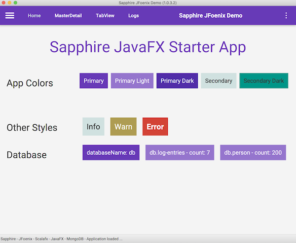

# Samples Advanced

Advanced [sapphire-javafx](https://github.com/sfxcode/sapphire-javafx) examples.

## sapphire-jfoenix-demo

There is a Starter Project build with [JFoenix](https://github.com/jfoenixadmin/JFoenix) on github: [sapphire-jfoenix-demo](https://github.com/sfxcode/sapphire-jfoenix-demo)

### Features
* MVC Patttern
* Layout, Pages, Components, Widgets
* JFoenix UI Components and Sass Styling
* FXML Pattern (Table, Bindings, Expressions)
* (Local) MongoDB Database featured by [simple-mongo](https://sfxcode.github.io/simple-mongo)
* CRUD Sample

