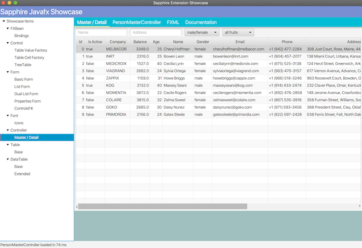
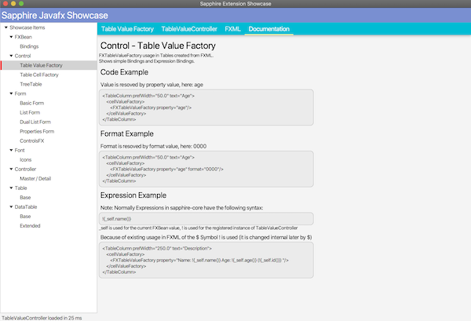
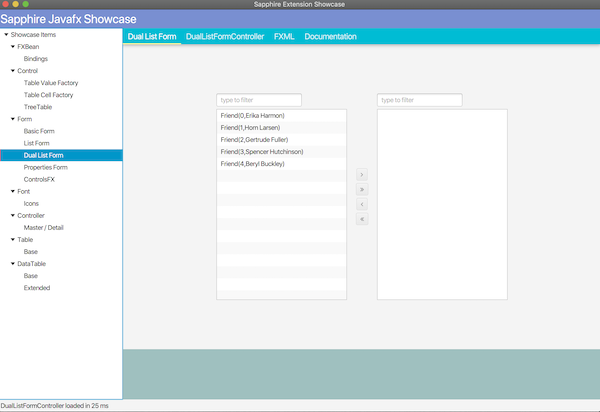

# Showcase

Showcase shows UI Components, Pattern, Examples ...

If someone will take a quick look how something is implemented, this is a good place.

## Showcase Parts

* UI Shows the UI Output
* SFXViewController Code
* FXML Code
* Some docs - more to come

## Showcase Impressions

